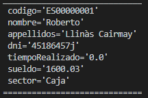
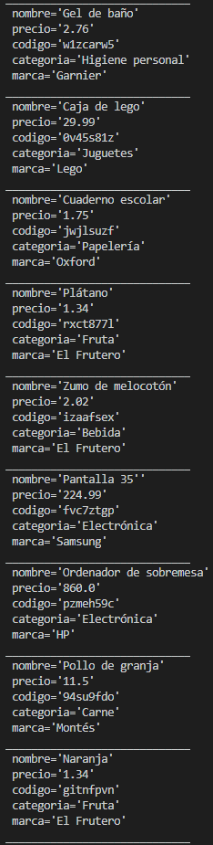
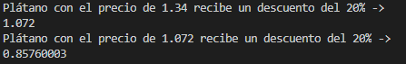
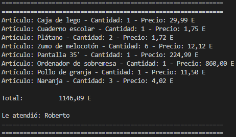

# Pago de tienda
Un pequeño proyecto personal, en principio de Java con Maven, que pretende simular un software muy sencillo de una tienda. El proposito es repasar un poco el lenguaje.

## Historias de usuario
### _Historia de usuario 1_
Consiste en crear una caja y asignarle un empleado.

### _Historia de usuario 2_
Consiste en crear un inventario y añadirle los productos proporcionados por nuestros proveedores.

### _Historia de usuario 3_
Consiste en pasar por la cinta los productos que el cliente quiere comprar.

### _Historia de usuario 4_
Consiste en eliminar un producto que el cliente ya no quiere comprar.

### _Historia de usuario 5_
Consiste en aplicar un descuento al producto "Plátano" del 20%.

### _Historia de usuario 6_
Consiste en realizar el pago del cliente e imprimir el ticket por pantalla.

